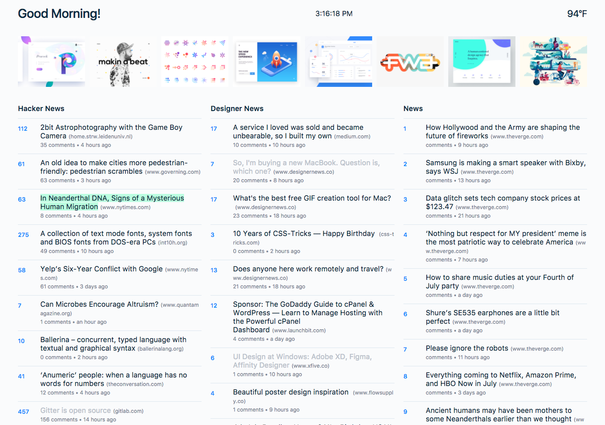

# Trending

A simple news reader application built on React. *Work in progress.*

## Feeds To Add
- [x] Hacker News
- [x] Designer News
- [x] Dribbble
- [ ] Twitter
- [ ] Medium
- [ ] Reddit

### References

Tools:
- https://github.com/HackerNews/API
- https://github.com/github/fetch
- https://momentjs.com/docs/
- https://github.com/DesignerNews/dn_api_v2
- http://developer.dribbble.com/v1/
- https://github.com/motdotla/dotenv
- https://www.npmjs.com/package/firebase-hackernews
- https://facebook.github.io/jest/

Articles:
- https://medium.com/@shopsifter/using-a-function-in-setstate-instead-of-an-object-1f5cfd6e55d1
- https://daveceddia.com/ajax-requests-in-react/
-  https://daveceddia.com/where-fetch-data-componentwillmount-vs-componentdidmount/
- Performance of regex to parse urls: https://jsperf.com/url-parsing-regex-vs-createelement
